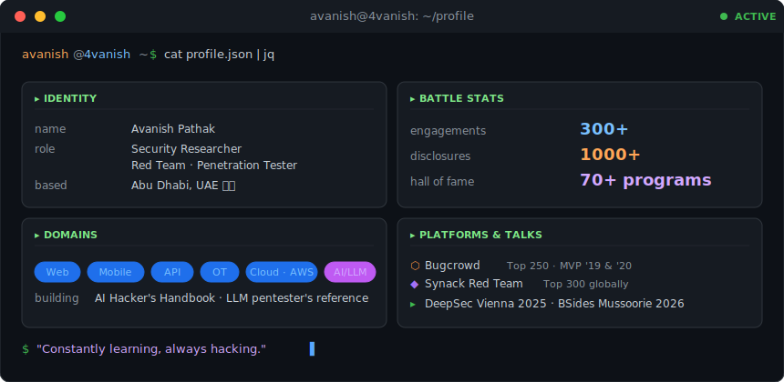

<!--
  GitHub profile README — github.com/4vanish/4vanish
  Auto-renders on https://github.com/4vanish
-->

  

  
  
  
  
  

  

  

  
  
  

---

## 🏆 Hall of Fame

> Recognized by 70+ programs for responsibly disclosed vulnerabilities.

  &nbsp;&nbsp;
  &nbsp;&nbsp;
  &nbsp;&nbsp;
  &nbsp;&nbsp;
  &nbsp;&nbsp;
  &nbsp;&nbsp;
  &nbsp;&nbsp;
  

  &nbsp;&nbsp;
  &nbsp;&nbsp;
  &nbsp;&nbsp;
  &nbsp;&nbsp;
  &nbsp;&nbsp;
  &nbsp;&nbsp;
  &nbsp;&nbsp;
  

  &nbsp;&nbsp;
  &nbsp;&nbsp;
  &nbsp;&nbsp;
  

<b>+ 50 more programs</b> · including Lemonade · Poshmark · McGraw Hill · Adaptavist · K15t · ROKT · Gallup · Centrify · Chargify · Constant Contact · Teramind · …

### CTFs & Battles

| | |
|---|---|
| 🥈 | **2nd place — Microsoft AI Security CTF**  ·  Microsoft HQ Dubai  ·  2026 |
| 🥈 | **2nd place — CYSEC GLOBAL 2025 CTF**  ·  UAE |
| 🥈 | **2nd place — CIS CYBERFORGE Bug Bounty Showdown**  ·  Abu Dhabi |
| 🚩 | **Pwned BlackSky: Hailstorm**  ·  HackTheBox AWS Cloud Security CTF |

---

## 📜 Certifications

| Credential | Issuer |
|------------|--------|
| **Certified AI/ML Pentester** (C-AI/ML Pen) | The SecOps Group |
| **Certified Android Security Engineer** (CASE) | 8kSec |
| **Certified AppSec Practitioner** (CAP) | The SecOps Group |
| **Certified in Cybersecurity** (CC) | (ISC)² |
| **BlackSky: Hailstorm — AWS Cloud Security** | HackTheBox |
| **Certified Cloud Associate** | — |

---

## 🎤 Speaking

| Year | Venue | Role |
|------|-------|------|
| **2026** | [Security BSides Mussoorie](https://bsidesmussoorie.com) · India 🏔️ | Upcoming Speaker |
| **2025** | [DeepSec.net](https://deepsec.net) · Vienna, Austria 🇦🇹 | Speaker |
| **2022** | Security BSides Ahmedabad · India 🇮🇳 | Panelist · Bug Bounties |

---

## 📌 Featured Work

### [🛡️ AI Hacker's Handbook](https://github.com/4vanish/AI-Chatbot-Pentesting-Playbook)

A copy-paste reference of payloads, prompts, and commands for pentesting AI chatbots and LLM-powered applications. Covers the **OWASP LLM Top 10** plus frontier vectors: MCP poisoning, A2A protocol attacks, RAG and memory poisoning, function-calling abuse, and computer-use agent screen-injection.

  

  
  
  

---

### [📝 Getting Started with Android Application Security](https://www.cobalt.io/blog/getting-started-with-android-application-security)

A practitioner's primer published on the **Cobalt** blog — covers tooling, static and dynamic analysis, certificate pinning, root detection bypass, and common findings in production Android apps. Written for testers running their first mobile pentest.

---

## 🧰 Arsenal

  
  
  
  
  
  
  
  

---

## ✍️ Selected Writing

- 📝 [*Getting Started with Android Application Security*](https://www.cobalt.io/blog/getting-started-with-android-application-security) — **Cobalt** blog
- 📝 *Understanding Insecure Deserialization* — **CPX** blog
- 📝 *Exploiting OTP Features for Account Takeover* · [Medium](https://avanishpathak.medium.com)
- 📝 *An Account Takeover via Response Manipulation* · [Medium](https://avanishpathak.medium.com)

---

## 🤝 Let's Connect

  
  
  
  
  

  

